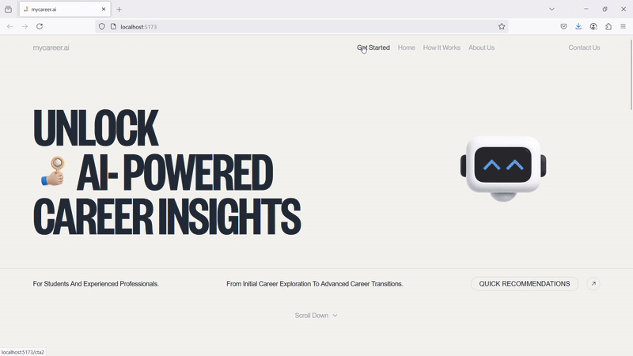

# 🎯 AI-Based Career Counselling

An intelligent, two-mode career guidance platform that recommends ideal occupations based on users' **personality traits, interests, and education background** using AI and Machine Learning.

---

## 🔍 Project Overview

This system offers two modes:

1. **With Questions Mode:**  
   Users answer **OCEAN (Big Five)** and **RIASEC (Holland Code)** questions + select their education category.

2. **Without Questions Mode:**  
   Users provide a free-text input (skills, education, experience) and get career recommendations via **NLP-based analysis**.

The platform uses **cosine similarity**, **TF-IDF**, **sentence-transformers**, and **PCA** to match user profiles to the best career options using the O*NET occupation database.

---
## 🎬 Demo Showcase

### **1. Landing**  
  

### **2. With Questions Mode**  
  

### **3 .Without Questions Mode**  
  

---

## 🧰 Tech Stack

- **Frontend:** React.js, Tailwind CSS, Vite  
- **Backend:** Node.js, Express.js, MongoDB  
- **ML/NLP:** Python, Flask, Sentence Transformers, TF-IDF, PCA  

---

## 🚀 How to Run Locally
### 1. Clone the Repository
Prerequisite : Git 
```bash
git clone https://github.com/aursalan/AI-Based-Career-Counselling.git
cd AI-Based-Career-Counselling
``` 
### 2. Run Database 
Prerequisite : MongoDB Community Edition 
```bash
#Copy the database directory path
cd database
mongod --dbpath "paste copied path"
```

### 3. Start the Backend Server
Prerequisite : Node.js 
```bash
cd backend 
node server.js 
```

### 4. Start the ML Flask Server
Prerequisite : Python 3.11 
```bash 
cd ml
.venv\Scripts\activate
pip install -r requirements.txt 
python -m spacy download en_core_web_sm
python -m nltk.downloader wordnet
python CBF_Recommendation.py
python CBF_using_AI.py
```

### 5. Start the Frontend
Prerequisite : Node.js, Vite, TailwindCSS  
```bash 
npm install 
npm run dev 
```

### Visit: http://localhost:5173

--- 

## 💡 Features
- Two recommendation modes
- Questionnaire scoring using RIASEC & OCEAN models
- Natural Language Processing for free-text inputs
- MongoDB-based storage and retrieval
- Modular, scalable ML & web architecture

--- 

## 📌 Future Improvements
- Add resume upload + parsing support
- Include real-time job market trends (e.g., LinkedIn, Glassdoor)
- Add facial emotion + mouse tracking for behavior analysis
- Deploy using Docker or cloud (Render, Heroku, Railway)

--- 

### 📄 License
This project is licensed under the [MIT License](LICENSE).

---

### 👤 Author

Created by **Aursalan Sayed**
[LinkedIn](https://linkedin.com/in/aursalan)
